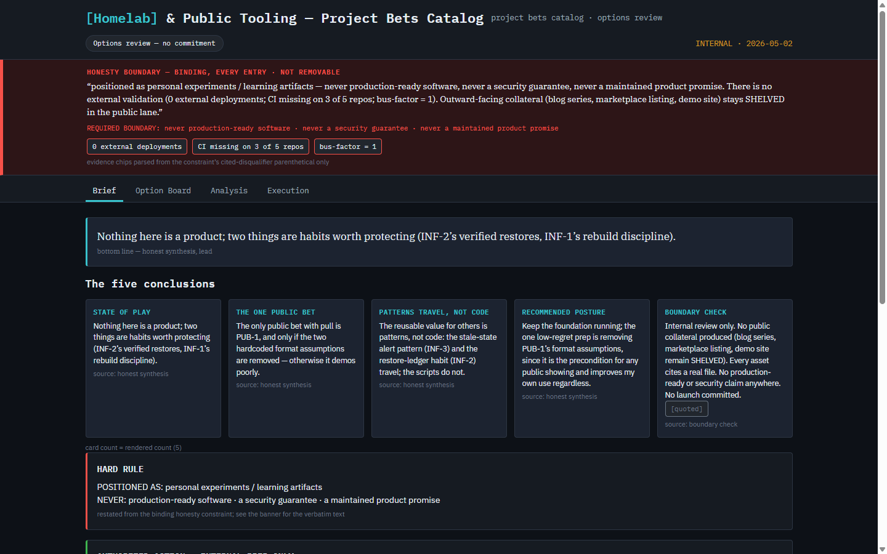
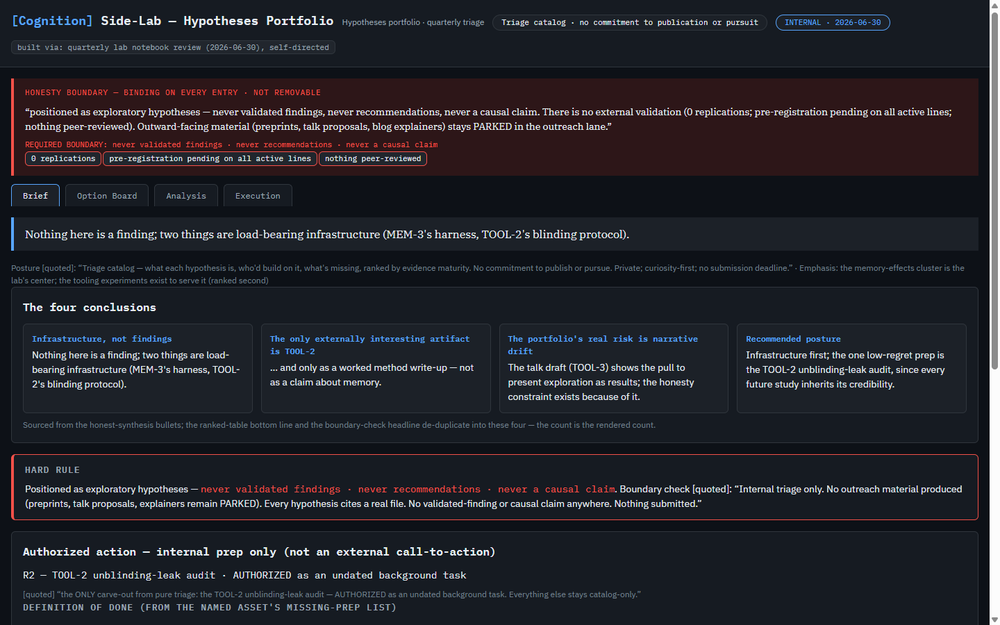

# Command Center Dashboard Generator





A generator prompt I wrote for my own workflow. Paste it into a capable LLM along with a strategy
map — a project-bets board, an options catalog, a hypotheses portfolio — and it returns a single
self-contained HTML dashboard that opens by double-clicking, offline.

The design goal is that the dashboard doesn't quietly make the work look better than it is. Missing
values render as `UNKNOWN`. Conflicting values render as `CONFLICT(a | b)`. Qualitative labels reach
chart coordinates through a closed whitelist, or — where an axis uses some other lexicon, conviction
or confidence rather than high/medium/low — by ordering the distinct values that map actually uses
and spacing them evenly across the axis. A label that fits neither route lands in an "unmapped" strip
instead of being coerced to a nearby number. Deferred and outward-facing items are grayed with no
call to action, computed from the map's `boundary_check` and `operator_decisions` sections.

**This is a prompt, not a validator.** A model can violate any rule in it, and long HTML generations
are where they do. `verify.py` catches the violations that are mechanically catchable; the rest I
check by eye. An empty-looking card usually means the guard worked.

The two screenshots above are the same generator run on two unrelated maps. What repeats between them
is the skeleton the prompt imposes — the tab bar, the honesty banner, the boundary block. What differs
is everything the map supplies: the title, the assets, the matrix axes, the section headings.

## Contents

| File | What it is |
|---|---|
| `GENERATOR_PACKAGE.md` | The full package. §B is the prompt you paste; §C how to invoke; §D a worked example input with §E its expected output; §F a vocabulary glossary; §G why each rule exists; §H the render bug that motivated §7; §I review axes and what is still unproven; §J a TL;DR. |
| `verify.py` | Mechanical checks against §7/§8/§6.6. Python standard library only (`argparse`, `re`, `sys`, `urllib.parse`). |
| `examples/demo_source_map.md` | The reference example map — a homelab project-bets catalog, same content as §D. |
| `examples/demo_dashboard.html` | Its dashboard. 51,372 bytes. |
| `examples/research_portfolio_map.md` | A second map in an unrelated domain — a research-hypotheses portfolio. |
| `examples/research_dashboard.html` | Its dashboard. 52,889 bytes. |
| `docs/demo_dashboard.png` | Screenshot of the first dashboard, above the fold. |
| `docs/research_dashboard.png` | Screenshot of the second. |
| `LICENSE` | MIT. |

## Using it

1. Copy everything between the `BEGIN GENERATOR PROMPT` and `END GENERATOR PROMPT` markers in §B.
2. Paste it into a fresh session with a model that can emit one large HTML file.
3. Below it, paste your map under a literal `### SOURCE MAP` heading. Without that heading the prompt
   accepts the map by shape and emits a top-of-file HTML comment noting the missing delimiter — that
   comment is correct behavior.
4. Save the returned HTML and double-click it. It should render fully, offline, from disk. A blank
   page means the model violated §7; reply asking for a re-do per §7/§8 as a standalone vanilla-JS
   single file with no CDN runtime.

## Checking the output

```
python verify.py my_dashboard.html --map my_map.md
```

18 checks over the mechanically checkable parts of §7, §8 and §6.6:

- **1–9** — the file:// breakers. No `<script type="module">`, no ES `import`/`export`, no dynamic
  `import()`, no `fetch()`/XHR, no top-level `await`, no `<script src=>` at all, at most one external
  reference and only if it is a fonts stylesheet, no local file references, every `` a
  `data:` URI. Check 5 is the exception in that list and says so in its own name: separating a
  top-level `await` from one inside an async function needs brace-depth analysis it does not do, so
  it lists every `await` as a warning for a human and never fails. It warned on the Opus run.
- **10–11** — single source of truth. Exactly one `MAP` object assignment; no hardcoded colors
  outside `:root`.
- **12–13** — honesty and generalization. Call-to-action verbs outside quoted blocks;
  reference-example vocabulary that does not appear in your source map.
- **14–16** — render hygiene. Every `font-family` ends in a generic family, the fonts stylesheet does
  not block render, `DOCTYPE` first and `</html>` last with no surrounding prose.
- **17** — the expected asset codes, ranks, and binding-constraint text are present.
- **18** — the model's own §8 self-check attestation matches what the verifier actually found.

Every run ends by printing what it does **not** check — whether the page renders at all, whether the
root render fires after its dependencies, whether the banner and panels are present on every tab,
whether every number traces back to your map, whether parked assets actually render gray, DAG
correctness, restated asset literals, and messy-input handling. Those need a browser or a human.

Other flags: `--reference` suppresses check 13 for the reference example itself. `--expect NAME`
applies a named per-example fixture to check 17. `--prompt` re-emits any failures as a paste-ready
repair instruction for the model. `--self-test` injects one violation per check and confirms each
check detects it.

## The two examples

There are two worked examples because one is not evidence. The generator was written against a
homelab project-bets catalog; `examples/research_portfolio_map.md` is a research-hypotheses portfolio
in an unrelated domain. The two screenshots at the top of this file are those two runs.

They are not word-disjoint, and an earlier draft of this file wrongly said they were. The honesty
chrome is itself words, and the prompt puts the same furniture on every dashboard it generates. The
tab bar is the clearest case: §6.1 prescribes `Brief / Option Board / Analysis / Execution` by name,
and both files carry that list byte-identically. Both also carry a `REQUIRED BOUNDARY` block, a
`[quoted]` marker, an honesty banner and a hard-rule block — though those last two are not the same
strings, only the same furniture: the demo run shouts them (`HONESTY BOUNDARY — BINDING`) where the
research run uses sentence case (`Honesty boundary — binding`). What the pair actually shows is the
split — chrome from the prompt, content from the map — and that is a thing you look at rather than a
thing I measured.

The one direction of it that is checked mechanically is narrow. Check 13 passes on
`research_dashboard.html`, which means none of the nine reference-example words the checker
carries — `homelab`, `provisioning`, `backup`, `restore`, `dotfiles`, `monitoring`, `showcase`,
`adoption-reality`, `community pull` — reached the research dashboard without also appearing in the
research map. It is a provenance test over nine words on one file. It does not establish that no
reference-example vocabulary leaked, only that those nine did not.

Both committed dashboards pass:

```
python verify.py examples/demo_dashboard.html --reference --expect demo
  15 pass, 0 fail, 1 warn, 2 skip (exit 0)

python verify.py examples/research_dashboard.html --map examples/research_portfolio_map.md --expect research
  16 pass, 0 fail, 1 warn, 1 skip (exit 0)
```

The warning on each is check 12, and it is the check reporting rather than judging — see Known
limits. Neither dashboard carries a §8 self-check attestation — both were generated before the
prompt required one — so check 18 skips on both.

## Where it's been run

One generation per model, no retries, all on 2026-07-28, each from
`examples/research_portfolio_map.md` using §B verbatim. This is a record of three specific runs. It
is not a benchmark and not a claim about any of these models in general.

| Model | `verify.py` | Self-check honest? | What happened |
|---|---|---|---|
| Codex CLI 0.139.0, configured default `gpt-5.6-sol` | dispatch unavailable | n/a — failed before generation | The CLI rejected the run at the API layer in 28 seconds: the account's configured default model requires a newer Codex client than the one installed. No dashboard was produced, so there is nothing to adjudicate. Recorded as it happened — no model override, no CLI upgrade, no retry. |
| Claude Opus 5 | 15 pass, 0 fail, 3 warn, 0 skip (exit 0) | yes | 88,563 bytes, complete document. Check 18 compared the model's own attestation against what the verifier found and they agreed; sections 8.8 and 8.9 were reported as not mechanically checkable rather than claimed clean. On the first adjudication this run scored FAIL 17 and SKIP 18. Both were bugs in the verifier, not defects in the output, and both were fixed before this row was recorded — see Known limits. |
| Local `qwen3.5:9b` (Ollama, Q4_K_M, 9.7B) | not run — the output was classified `incomplete` before verification | n/a | 14,533 characters. Ran 11.9 minutes and stopped on its own. Not a valid HTML document as delivered, so the verifier was not run against it: a malformed document and a rule violation are different limits, and running the checks over broken markup would have reported one root cause as a list of unrelated failures. See Known limits. |

## Known limits

**It needs a frontier-class model, and that is measured rather than assumed.** `qwen3.5:9b` ingested
the full prompt — 10,787 prompt tokens, no truncation — generated for 11.9 minutes, and stopped with
`done_reason: "stop"`, believing it was finished. It produced 14,544 bytes against Opus's 88,563. The
content was right: real asset codes pulled from the map, nothing hallucinated. The structure was not.
No `<body>` opening tag, `<head>` never closed, a second `<style>` opened without
closing the first, and a render script calling `getElementById` on element IDs the model never wrote.
It authored the data and the rendering logic and never emitted the skeleton for them to attach to. In
a browser it would throw on its first DOM call.

**A green `--self-test` proves only that the checks detect the violations in `INJECTIONS`.** Nothing
more. During this build the self-test reported all-green through several genuinely broken states —
three consecutive rounds of the verifier's development each reported a full pass over a defect that
was live the whole time, and the same shape recurred later. It is a regression guard, not a proof of
correctness.

**The verifier had been tuned against one model's output shape without anyone intending it.** The
first generation from a different model produced two false verdicts. Check 17 read ranks from
redacted text, so a dashboard storing `rank:"3"` as a string had all six rankings reported missing —
the committed example stores `rank:3` as a bare number, which is why it never surfaced. Check 18
rejected a correct attestation because the model followed it with a comment documenting its evidence
for each claim, which is better behavior, not worse. Both were fixed before any result above was
recorded. Every round of adversarial review in this build ran against synthetic fixtures and
hand-built attack inputs, and none of them surfaced either bug; one real foreign generation surfaced
both at once. The same pattern had already shown up once: baselining the verifier against the two
committed dashboards tripped check 11 on both, 40 flagged declarations in total, and every one of the
40 was a bug in the checker rather than a defect in the dashboard.

**Three false verdicts are live in `verify.py` right now.** The two above were found and fixed; these
were found and not, so that the paragraph above is not read as "and then it was clean". Each
reproduces today against a copy of `examples/demo_dashboard.html`, and each is a false FAIL at exit 1
— the verifier calling a compliant file broken:

- A commented-out CSS `url()` inside a `<style>` block trips check 8. The local-reference scan for
  `url(...)` runs over raw lines by design, because its real homes are a `<style>` body and a script
  assigning `el.style.background`; the cost of that is that a CSS comment is not excluded.
- `window.MAP = MAP;` written beside the real assignment trips check 10. §8.2 asks for one `MAP`
  object; an alias is a second assignment but not a second object, and the check counts assignments.
- A CSS Fonts Level 4 generic family — `math`, `emoji`, `fangsong`, `ui-rounded` — trips check 14.
  Its list of accepted generics stops at `ui-monospace`/`ui-sans-serif`/`ui-serif` and never grew the
  rest, so a `font-family` ending in one of those four reads to it as ending in no generic at all.

A false FAIL is the better direction to fail in, and I would rather ship these than narrow the checks
to make them quiet. But each is the tool being wrong about a correct file, and none is fixed.

**Check 12 reports, it does not judge.** It lists call-to-action verbs, and its pattern is stem-based,
so it also matches negations and descriptive inflections — "No launch committed", "No commitment to
publish or pursue". More importantly, it cannot determine quoted-block membership: the `[quoted]`
markers are built in JavaScript at runtime, so a static text scan cannot know which rendered strings
end up inside one. Every hit is a warning for a human. On the two committed dashboards all six hits
sit inside `<script>` bodies, zero are in live HTML text, and reading the renderer shows the copy is
correctly quoted. That is a limit of the tool, not a call to action either dashboard should not have.

**Check 17 is not an adversarial control.** It compares a dashboard's `MAP` literal against a fixture
derived from its source map: asset codes present, ranks forming 1..N without duplicates or gaps and
paired to the right codes, and the binding-constraint sentence present verbatim. It is regex-based
structural matching over a JavaScript data literal; it does not evaluate JavaScript. It is built to
catch a model that invented or dropped data. A deliberately constructed decoy can defeat it — two
such constructions are known and demonstrated, a zero-width-joiner field name that evades the
identifier-boundary anchor, and a substitute owner object when the real `code:` field is removed
entirely. Neither is reachable by ordinary generation error. If it cannot parse the `MAP` body safely
it fails and says so; it never passes on inability to check.

**The package specifies one verification step its own reference output makes impossible to perform.**
§8.6(c) tells a reader to grep the output for call-to-action verbs "outside `[quoted]` blocks". The
reference dashboard builds its `[quoted]` markers in JavaScript at runtime, so that grep cannot
actually be run against the file. This is a finding about the package, not about either dashboard.

Smaller ones:

- The model has to emit roughly 50 KB of HTML in one response. Both committed examples are just over
  that.
- Single-shot. There is no iteration loop beyond re-prompting with `--prompt` output.
- The dashboard is a snapshot of the map at generation time, not live data.
- A map with no parseable binding honesty constraint drops the prompt into DEGRADED mode, which grays
  every posture bucket and chips every card "boundary unverified". The honesty constraint is the only
  thing DEGRADED keys on — front-matter that won't parse at all routes to that same rule, and nothing
  else reaches it. A terse or missing boundary section does not degrade anything: the boundary block
  falls back to the constraint text. A missing rank does not either; it sorts last under `UNRANKED`,
  and gaps and duplicate ranks render verbatim with a marker.
- `verify.py` reads text. It does not open a browser, so the check that matters most — does the page
  actually render — is still mine to run by double-clicking the file.

## Provenance

Built in a solo-operator workflow in 2026. The strategy map that drove the design stays private; the
worked example in §D is a real-shaped stand-in in a neutral domain. §G records, rule by rule, the
failure each hardening rule was written to block; that is the content. Its opening sentence cites a
finding count with a severity split, from a review I ran on my own work against no published rubric
for what made a finding critical or major. Treat the reasoning as the substance and the numbers as
unbacked.
